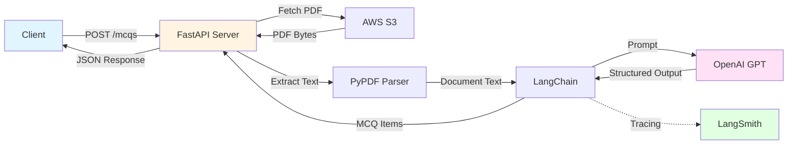

<div align="center">

# 🎯 Vibe-2025

### AI-Powered Multiple Choice Question Generator

Transform your PDFs into comprehensive MCQs using cutting-edge AI technology

[](https://www.python.org/downloads/)
[](https://fastapi.tiangolo.com)
[](https://langchain.com)
[](https://openai.com)
[](https://github.com/astral-sh/uv)
[](https://www.docker.com/)
[](LICENSE)

[Features](#-features) •
[Quick Start](#-quick-start) •
[API Docs](#-api-documentation) •
[Docker](#-docker-deployment) •
[Examples](#-usage-examples)

</div>

---

## ✨ Features

<table>
<tr>
<td>

🤖 **AI-Powered Generation**  
Leverage OpenAI's GPT models via LangChain for intelligent question generation

📄 **PDF Processing**  
Extract and analyze content from PDF documents with pypdf

☁️ **AWS S3 Integration**  
Seamlessly fetch PDFs directly from S3 buckets

</td>
<td>

🎯 **Structured Output**  
Generate properly formatted MCQs with explanations

🚀 **Production Ready**  
Built with FastAPI for high performance and scalability

📊 **LangSmith Integration**  
Track and monitor AI chain performance

</td>
</tr>
</table>

---

## 🏗️ Architecture



---

## 🚀 Quick Start

### Prerequisites

- Python 3.13 or higher
- [UV package manager](https://github.com/astral-sh/uv)
- OpenAI API key
- AWS credentials (for S3 access)
- LangSmith API key (optional, for tracing)

### Installation

```bash
# Clone the repository
git clone https://github.com/yourusername/vibe-2025.git
cd vibe-2025

# Install dependencies with UV
uv sync

# Or use pip
pip install -e .
```

### Environment Setup

Create a `.env` file in the `fastapi` directory:

```env
# OpenAI Configuration
OPENAI_API_KEY=sk-...

# LangSmith Configuration (Optional)
LANGSMITH_API_KEY=ls__...
LANGSMITH_ENDPOINT=https://api.smith.langchain.com

# AWS Configuration
AWS_ACCESS_KEY_ID=your_access_key
AWS_SECRET_ACCESS_KEY=your_secret_key
AWS_REGION=us-east-1
```

### Running Locally

```bash
cd fastapi
uvicorn main:app --reload --host 0.0.0.0 --port 8000
```

The API will be available at `http://localhost:8000`

---

## 📚 API Documentation

### Endpoints

#### `GET /`
Health check endpoint

**Response:**
```json
{
  "status": "ok",
  "service": "mcq-generator"
}
```

#### `GET /health`
Service health status

**Response:**
```json
{
  "status": "ok"
}
```

#### `POST /mcqs`
Generate MCQs from a PDF stored in S3

**Request Body:**
```json
{
  "s3_uri": "s3://your-bucket/path/to/document.pdf",
  "max_questions": 10
}
```

**Response:**
```json
{
  "items": [
    {
      "question": "What is the primary function of the heart?",
      "options": [
        "Pump blood throughout the body",
        "Filter toxins from blood",
        "Produce red blood cells",
        "Store oxygen"
      ],
      "correct_index": 0,
      "explanation": "The heart's primary function is to pump oxygenated blood throughout the body via the circulatory system."
    }
  ]
}
```

### Interactive API Docs

Once the server is running, visit:
- **Swagger UI**: `http://localhost:8000/docs`
- **ReDoc**: `http://localhost:8000/redoc`

---

## 🐳 Docker Deployment

### Build and Run

```bash
cd fastapi

# Build the image
docker build -t vibe-2025 .

# Run the container
docker run -d \
  --name mcq-generator \
  -p 8000:8000 \
  --env-file .env \
  vibe-2025
```

### Docker Compose

```bash
cd fastapi
docker compose up -d
```

The service will be available at `http://localhost:8000`

---

## 💡 Usage Examples

### Python Client

```python
import requests

# Generate MCQs from a PDF
response = requests.post(
    "http://localhost:8000/mcqs",
    json={
        "s3_uri": "s3://my-bucket/educational/biology.pdf",
        "max_questions": 5
    }
)

mcqs = response.json()
for item in mcqs["items"]:
    print(f"Q: {item['question']}")
    for i, option in enumerate(item['options']):
        marker = "✓" if i == item['correct_index'] else " "
        print(f"  [{marker}] {option}")
    print(f"Explanation: {item['explanation']}\n")
```

### cURL

```bash
curl -X POST "http://localhost:8000/mcqs" \
  -H "Content-Type: application/json" \
  -d '{
    "s3_uri": "s3://your-bucket/document.pdf",
    "max_questions": 10
  }'
```

### JavaScript/TypeScript

```typescript
const response = await fetch('http://localhost:8000/mcqs', {
  method: 'POST',
  headers: { 'Content-Type': 'application/json' },
  body: JSON.stringify({
    s3_uri: 's3://your-bucket/document.pdf',
    max_questions: 10
  })
});

const data = await response.json();
console.log(data.items);
```

---

## 🛠️ Development

### Project Structure

```
vibe-2025/
├── fastapi/
│   ├── main.py              # FastAPI application
│   ├── requirements.txt     # Python dependencies
│   ├── Dockerfile          # Container image
│   └── compose.yaml        # Docker Compose config
├── data/                   # Sample data files
├── pyproject.toml          # Project configuration
└── uv.lock                # UV lock file
```

### Development Setup

```bash
# Install dev dependencies
uv sync --group dev

# Format code
black .

# Run the development server
cd fastapi
uvicorn main:app --reload
```

---

## 📋 Dependencies

<details>
<summary>Click to expand</summary>

### Core
- **FastAPI** - Modern web framework for building APIs
- **Uvicorn** - ASGI server implementation
- **Pydantic** - Data validation using Python type hints

### AI/ML
- **LangChain Core** - Building applications with LLMs
- **LangChain OpenAI** - OpenAI integration for LangChain
- **LangSmith** - Observability and monitoring

### Document Processing
- **PyPDF** - PDF parsing and text extraction

### Cloud Integration
- **Boto3** - AWS SDK for Python
- **Botocore** - Low-level AWS service access

### Utilities
- **python-dotenv** - Environment variable management

</details>

---

## 🔐 Security Notes

- Never commit your `.env` file or API keys to version control
- Use AWS IAM roles when deploying to AWS infrastructure
- Implement rate limiting for production deployments
- Validate and sanitize all input data
- Use HTTPS in production environments

---

## 🤝 Contributing

Contributions are welcome! Please feel free to submit a Pull Request.

1. Fork the repository
2. Create your feature branch (`git checkout -b feature/amazing-feature`)
3. Commit your changes (`git commit -m 'Add some amazing feature'`)
4. Push to the branch (`git push origin feature/amazing-feature`)
5. Open a Pull Request

---

## 📝 License

This project is licensed under the MIT License - see the [LICENSE](LICENSE) file for details.

---

## 🙏 Acknowledgments

- [LangChain](https://langchain.com) for the amazing framework
- [OpenAI](https://openai.com) for powerful language models
- [FastAPI](https://fastapi.tiangolo.com) for the excellent web framework
- [UV](https://github.com/astral-sh/uv) for fast Python package management

---

<div align="center">

**[⬆ back to top](#-vibe-2025)**

Made with ❤️ and AI

</div>