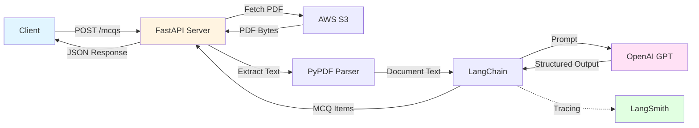
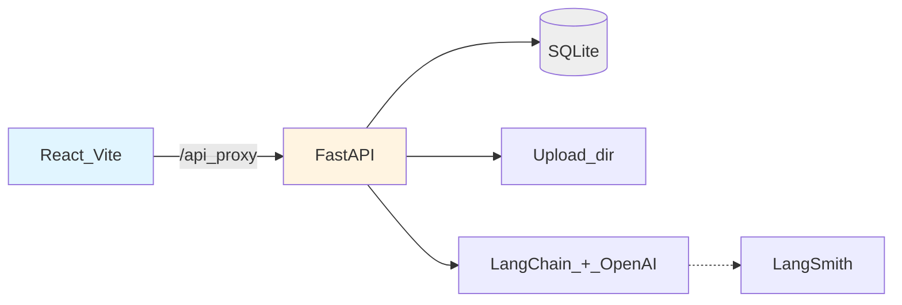

<div align="center">

# 🎯 Vibe-2025

### AI-Powered Multiple Choice Question Generator

Transform your PDFs into comprehensive MCQs using cutting-edge AI technology

[](https://www.python.org/downloads/)
[](https://fastapi.tiangolo.com)
[](https://langchain.com)
[](https://openai.com)
[](https://github.com/astral-sh/uv)
[](https://www.docker.com/)
[](LICENSE)

[Features](#-features) •
[Quick Start](#-quick-start) •
[grml tasks](#grml-tasks) •
[API Docs](#-api-documentation) •
[Docker](#-docker-deployment)

</div>

---

## ✨ Features

<table>
<tr>
<td>

🤖 **AI-Powered Generation**  
Leverage OpenAI's GPT models via LangChain for intelligent question generation

📄 **PDF Processing**  
Extract and analyze content from PDF documents with pypdf

☁️ **AWS S3 Integration**  
Seamlessly fetch PDFs directly from S3 buckets (`POST /mcqs`)

🖥️ **Web Dashboard**  
Optional React (Vite) UI: learning sessions, uploads, and MCQs via `/api`

</td>
<td>

🎯 **Structured Output**  
Generate properly formatted MCQs with explanations

🚀 **Production Ready**  
Built with FastAPI for high performance and scalability

📊 **LangSmith Integration**  
Track and monitor AI chain performance

💾 **Local persistence**  
SQLite + on-disk uploads for the web app (no S3 required for the UI flow)

</td>
</tr>
</table>

---

## 🏗️ Architecture

### Legacy / CLI flow (S3)


```mermaid
graph LR
    A[Client] -->|POST /mcqs| B[FastAPI Server]
    B -->|Fetch PDF| C[AWS S3]
    C -->|PDF Bytes| B
    B -->|Extract Text| D[PyPDF Parser]
    D -->|Document Text| E[LangChain]
    E -->|Prompt| F[OpenAI GPT]
    F -->|Structured Output| E
    E -->|MCQ Items| B
    B -->|JSON Response| A
    E -.->|Tracing| G[LangSmith]
    
    style A fill:#e1f5ff
    style B fill:#fff4e1
    style F fill:#ffe1f5
    style G fill:#e1ffe1
```

### Web UI flow


```mermaid
graph LR
    U[React_Vite] -->|/api_proxy| B[FastAPI]
    B --> DB[(SQLite)]
    B --> FS[Upload_dir]
    B --> E[LangChain_+_OpenAI]
    E -.-> L[LangSmith]
    
    style U fill:#e1f5ff
    style B fill:#fff4e1
    style DB fill:#eeeeee
```

---

## 🚀 Quick Start

Requires [grml](https://github.com/desertbit/grml) v2 on your `PATH`. All runnable steps below are **`grml`** tasks defined in [`grml.yaml`](grml.yaml).

### Prerequisites

- Python 3.13+, [uv](https://github.com/astral-sh/uv), Node.js 20+ and npm (installed by tasks as needed)
- OpenAI API key; optional LangSmith; AWS credentials only if you call `POST /mcqs` with `s3://` URIs

### Clone and install

Clone this repository, `cd` into it, then:

```bash
grml install
```

### Environment

Create **`fastapi/.env`** from [`fastapi/.env.example`](fastapi/.env.example) and set at least `OPENAI_API_KEY`. Optionally copy [`frontend/.env.example`](frontend/.env.example) to **`frontend/.env`** (demo login overrides, `VITE_API_BASE_URL` if you do not use the Vite proxy).

### Run locally

Use **two terminals** from the repo root:

```bash
grml dev api
```

```bash
grml dev ui
```

- API: **http://localhost:8000**
- Web UI: **http://localhost:5173** — default demo login `demo@example.com` / `demo` (overridable via `frontend/.env`)

---

## grml tasks

| Command | Purpose |
|--------|---------|
| `grml install` | Install Python (uv) and frontend (npm) dependencies |
| `grml dev api` | FastAPI with reload on port 8000 |
| `grml dev ui` | Vite dev server; proxies `/api` to the API |
| `grml frontend build` | Production frontend build (`tsc` + Vite) |
| `grml docker build` | Build the API Docker image (repo root context) |
| `grml docker run` | Run the API container on port 8000 |
| `grml docker compose` | `docker compose up -d` from `fastapi/` |
| `grml post mcqs` | Smoke `POST /mcqs` (needs API up, AWS env, valid `s3_uri` in [`grml.yaml`](grml.yaml) if you change the payload) |

Run `grml help` for nested commands and flags.

---

## 📚 API Documentation

### Endpoints

#### `GET /`
Health check endpoint

**Response:**
```json
{
  "status": "ok",
  "service": "mcq-generator"
}
```

#### `GET /health`
Service health status

**Response:**
```json
{
  "status": "ok"
}
```

#### `POST /mcqs`
Generate MCQs from a PDF stored in S3

**Request Body:**
```json
{
  "s3_uri": "s3://your-bucket/path/to/document.pdf",
  "max_questions": 10
}
```

**Response:**
```json
{
  "items": [
    {
      "question": "What is the primary function of the heart?",
      "options": [
        "Pump blood throughout the body",
        "Filter toxins from blood",
        "Produce red blood cells",
        "Store oxygen"
      ],
      "correct_index": 0,
      "explanation": "The heart's primary function is to pump oxygenated blood throughout the body via the circulatory system."
    }
  ]
}
```

#### App API (`/api/…`) — used by the web UI

All prefixed with `/api`. Examples: `POST /api/learning-sessions` (multipart), `GET /api/learning-sessions`, `GET /api/learning-sessions/{id}`, `POST /api/learning-sessions/{id}/mcqs`, `POST /api/documents/upload`, `GET /api/documents/session/{id}`, `DELETE /api/documents/{id}`. See **Swagger UI** for full schemas.

### Interactive API Docs

Once the server is running, visit:
- **Swagger UI**: `http://localhost:8000/docs`
- **ReDoc**: `http://localhost:8000/redoc`

---

## 🐳 Docker Deployment

From the **repository root**, with `fastapi/.env` present:

```bash
grml docker build
```

```bash
grml docker run
```

Compose (detached):

```bash
grml docker compose
```

Service URL: **http://localhost:8000**

---

## 🛠️ Development

### Project Structure

```
vibe-2025/
├── fastapi/
│   ├── app/                 # FastAPI package (routers, DB, MCQ core)
│   ├── main.py              # ASGI entry (uvicorn main:app)
│   ├── Dockerfile
│   └── compose.yaml
├── frontend/                # React + Vite (optional UI)
├── pyproject.toml
├── uv.lock
└── grml.yaml                # grml v2 task definitions
```

### Setup

Use **`grml install`** after cloning. For day-to-day work use **`grml dev api`** / **`grml dev ui`**; use **`grml frontend build`** before shipping the frontend bundle.

---

## 📋 Dependencies

<details>
<summary>Click to expand</summary>

### Core
- **FastAPI** - Modern web framework for building APIs
- **Uvicorn** - ASGI server implementation
- **Pydantic** - Data validation using Python type hints
- **SQLAlchemy** - ORM / SQLite for the web app API

### AI/ML
- **LangChain Core** - Building applications with LLMs
- **LangChain OpenAI** - OpenAI integration for LangChain
- **LangSmith** - Observability and monitoring

### Document Processing
- **PyPDF** - PDF parsing and text extraction

### Cloud Integration
- **Boto3** - AWS SDK for Python
- **Botocore** - Low-level AWS service access

### Utilities
- **python-dotenv** - Environment variable management
- **python-multipart** - Form / file uploads

### Frontend (optional)
- **React**, **Vite**, **TanStack Query**, **React Router**

</details>

---

## 🔐 Security Notes

- Never commit your `.env` file or API keys to version control
- Use AWS IAM roles when deploying to AWS infrastructure
- Implement rate limiting for production deployments
- Validate and sanitize all input data
- Use HTTPS in production environments
- The bundled web UI uses **demo auth** only — replace with real auth before production

---

## 🤝 Contributing

Contributions are welcome. Fork the repository on GitHub, push a branch with your changes, and open a pull request.

---

## 📝 License

This project is licensed under the MIT License - see the [LICENSE](LICENSE) file for details.

---

## 🙏 Acknowledgments

- [LangChain](https://langchain.com) for the amazing framework
- [OpenAI](https://openai.com) for powerful language models
- [FastAPI](https://fastapi.tiangolo.com) for the excellent web framework
- [UV](https://github.com/astral-sh/uv) for fast Python package management

---

<div align="center">

**[⬆ back to top](#-vibe-2025)**

Made with ❤️ and AI

</div>
